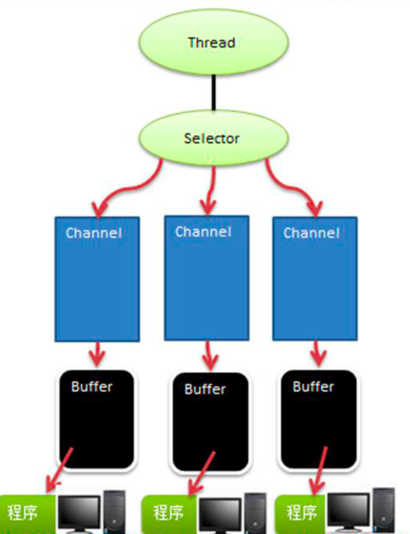

Nio三大核心
buffer、selector、channel

Buffer有几大子类：ByteBuffer（最常用）、ShortBuffer、CharBuffer、IntBuffer、LongBuffer、FloatBuffer、DoubleBuffer。
Buffer底层维护一个数组，由四个重要参数：
    position（数组中下一个可读或可写的位置）
    mark（标记）
    limit（最大可读或可写的位置）
    capacity（数组容量）

